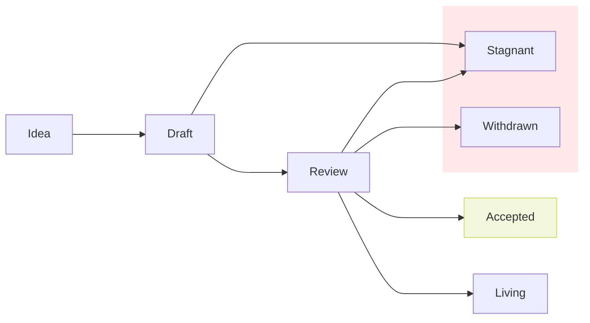

## What is a Proposal?

SMIP stands for Spacemesh Improvement Proposal. A proposal is a design
document describing a new feature for Spacemesh or its processes or
environment. The proposal should document the rationale for the feature and
enough documentation to understand the implementation.

## Rationale

A proposal is intended to be reviewed by core engineering and community members
keeping in mind security concerns, tradeoffs, and backwards compatibility.
Having a proposal process helps identify design issues early, alert the
community on a change, helps scale newer contributors on the architecture, and
acts as a historical record of the design decisions that have gone into
Spacemesh. For implementors, the proposal is a blueprint for the feature and
helps track the development of a feature.

## When you need to follow this process

You need to follow this process if you intend to make "substantial" changes to
mining, API, consensus, or a change to the proposal process itself. What
constitutes a "substantial" change is evolving based on community norms and
varies depending on what part of the ecosystem you are proposing to change, but
may include the following:

- A change in format of a RPC API method
- Networking interface changes between miners
- Compute requirement changes on the runtime

Some changes do not require a proposal:

- Rephrasing, reorganizing, refactoring, or otherwise "changing shape does not
change meaning".
- Additions that strictly improve objective, numerical quality criteria
(warning removal, speedup, better platform coverage, more parallelism, trap
more errors, etc.)

## Proposal Types

There are two types of proposals:

- A **Standard** Proposal describes any change that affects most or all
Spacemesh implementations, such as a change to the network protocol, consensus,
proposed application standards/conventions, block or transaction validity, or
any change or addition that affects the interoperability of applications using
Spacemesh. Standard proposals can be broken down into the following categories:

  - **Core**: Anything that affects consensus or substantial changes to the
miner.
  - **Networking**: Changes or substantial improvements to network protocol
specifications.
  - **Interfaces**: Breaking changes around the client API specifications and
standards.

- A **Meta** Proposal describes a process surrounding Spacemesh or proposes a
change to (or an event in) a process. Meta Proposals are like Standard
Proposals but apply to areas other than the Spacemesh protocol itself. They may
propose an implementation, but not to the Spacemesh codebase; they often require
community consensus and users are typically not free to ignore them. Examples
include procedures, guidelines, changes to the decision-making process, and
changes to the tools or environment used in Spacemesh development.

## Proposal Lifecycle

The stages in a lifecycle of a proposal are as follows:

- Idea
- Draft
- Review
- Accepted
- Living
- Stagnant
- Withdrawn
- Implemented

### Idea

At the idea stage, parties involved in the proposal are you -- the champion or
proposal author -- the reviewers, and the Spacemesh Core Contributors.

Before you begin writing a formal proposal, you should vet your idea. Ask the
Spacemesh core community first if an idea is original to avoid wasting time on
something that will be rejected based on prior research. It is thus recommended
to discuss the proposal on the [Spacemesh Discord](https://chat.spacemesh.io/)
under the #core-technology channel.

### Draft

To begin drafting the proposal, do the following:

- Fork the proposal repository
- Copy `XXXX-template.md` to `proposals/smip-XXXX-my-feature.md` (where "my-feature"
is descriptive)
- Fill in the proposal. Put care into the details: proposals that do not
present convincing motivation, demonstrate lack of understanding of the
design's impact, or are disingenuous about the drawbacks or alternatives tend
to be poorly received.
- Submit a pull request.
- Now that your proposal has an open pull request, use the issue number of the
PR to update the `XXXX-` prefix to the number.

### Review

During review, the owner of the proposal is in charge of gathering and
integrating feedback. The most relevant core contributors to the proposal
should be included in the review process. Review will take place completely
through Github so that all comments are collected and documented. Once
consensus is met by the core contributors, the proposal can either be accepted
or withdrawn. This step is typically taken when enough tradeoffs have been
considered for the core contributors to make a decision. It is not necessary
for all participants to reach consensus. However, there should not be a strong
consensus against the proposal outside of the core contributors.

### Accepted

Some accepted proposals represent vital features that can be implemented right
away. Other accepted proposals can wait until some arbitrary core contributor
feels like doing the work. Every accepted proposal should have an associated
tracking issue in an implementation repository. While it is not
*necessary* for the proposal author to also write the implementation, it is by
far the most effective way to see a proposal through to completion: authors
should not expect that other project developers will take on responsibility for
implementing their accepted feature.

### Living

A special status for SMIPs that are designed to be continually updated and not
reach a state of finality. This includes most notably SMIP-1. This status must
undergo extra scrutiny and review when updating the status from review to
living.

### Stagnant

If a proposal reaches six months without activity the proposal will be
marked as stale to be closed. A new proposal can be opened if the proposal is
closed and has a chance of reaching consensus.

### Withdrawn

The author has withdrawn the proposal. This state has finality and can no
longer be resurrected. If the idea is pursued at a later date it is considered
a new proposal.

## What belongs in a successful SMIP?

Each SMIP should have the following parts:

- Preamble - RFC 822 style headers containing metadata about the SMIP, including the SMIP number, a short descriptive title (limited to a maximum of 44 characters), a description (limited to a maximum of 140 characters), and the author details. Irrespective of the category, the title and description should not include SMIP number.
- Abstract - Abstract is a multi-sentence (short paragraph) technical summary. This should be a very terse and human-readable version of the specification section. Someone should be able to read only the abstract to get the gist of what this specification does. It should explain the planned high-level design of the change.
- Scope - The proposal must define the scope of the proposed change, e.g., components of the technical stack, processes, or designs that will be impacted by the proposed change. It should include all significant dependencies and interactions upon other components and processes.
- Stakeholders and Reviewers *(optional)* - The author may optionally specify individuals, organizations, or authors/maintainers of other technical components that should be involved in the review process of the proposal.
- Motivation *(optional)* - A motivation section is critical for SMIPs that want to change the Spacemesh protocol. It should clearly explain why the existing protocol specification is inadequate to address the problem that the SMIP solves. This section may be omitted if the motivation is evident.
- Specification - The technical specification should describe the syntax and semantics of any new feature. The specification should be detailed enough to allow competing, interoperable implementations for any of the current Spacemesh platforms.
- Rationale - The rationale fleshes out the specification by describing what motivated the design and why particular design decisions were made. It should describe alternate designs that were considered and related work/prior art, e.g., how the feature is supported in other languages or in other protocols. The rationale should discuss important objections or concerns raised during discussion around the SMIP.
- Backwards Compatibility *(optional)* - All SMIPs that introduce backwards incompatibilities must include a section describing these incompatibilities and their consequences. The SMIP must explain how the author proposes to deal with these incompatibilities. This section may be omitted if the proposal does not introduce any backwards incompatibilities, but this section must be included if backward incompatibilities exist.
- Test Cases *(optional)* - Test cases for an implementation are mandatory for SMIPs that affect consensus changes. Tests should either be inlined in the SMIP as data (such as input/expected output pairs, or included in `../assets/smip-####/<filename>`). This section may be omitted for non-Core proposals.
- Reference Implementation *(optional)* - An optional section that contains a reference/example implementation that people can use to assist in understanding or implementing this specification. This section may be omitted for all SMIPs.
- Performance Considerations - All SMIPs must contain a section that discusses potential performance implications/considerations relevant to the proposed change.
- Security Considerations - All SMIPs must contain a section that discusses the security implications/considerations relevant to the proposed change. Include information that might be important for security discussions, surfaces risks and can be used throughout the life-cycle of the proposal. E.g., include security-relevant design decisions, concerns, important discussions, implementation-specific guidance and pitfalls, an outline of threats and risks and how they are being addressed. SMIP submissions missing the "Security Considerations" section will be rejected.
- Copyright Waiver - All SMIPs must be in the public domain. The copyright waiver MUST link to the license file and use the following wording: `Copyright and related rights waived via [CC0](../LICENSE.md).`
